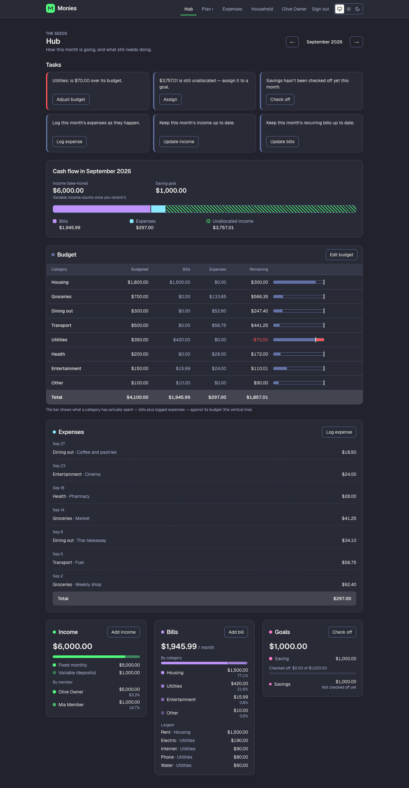
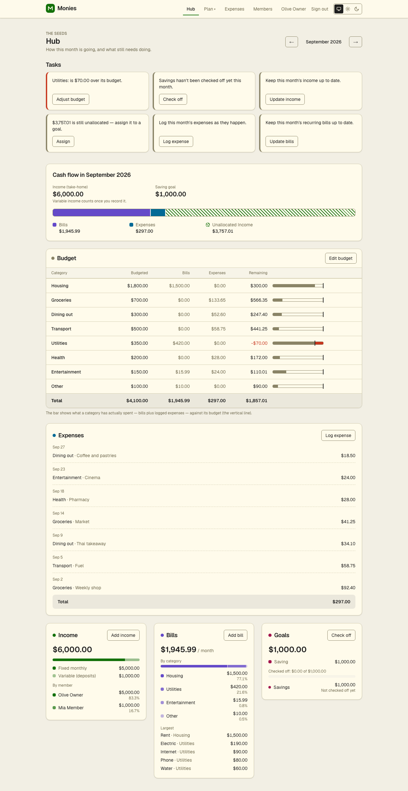
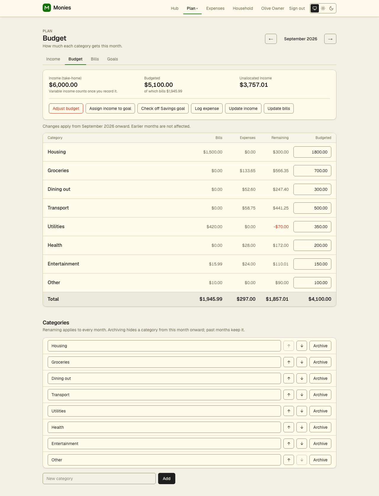
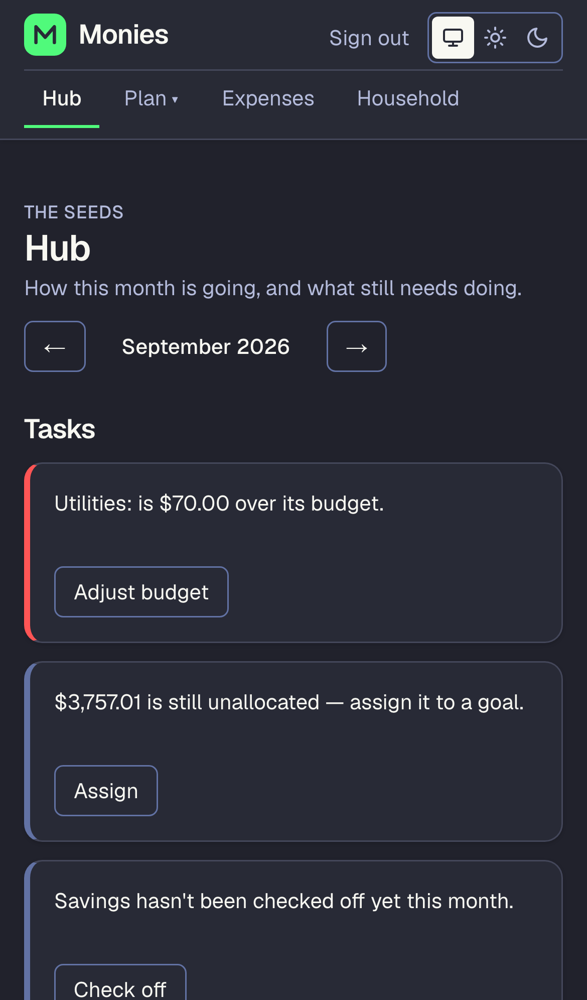

# Monies

[](https://github.com/tymattes/monies/actions/workflows/ci.yml)

A self-hosted, household-centric budgeting app. Web first, with a companion iOS app planned.

**Status:** in active development. Specs 001–044 are implemented — households, members and invites, categories and monthly budgets, income, bills, saving and debt-payoff goals, expenses, backup/restore, and the Hub are all working; the remaining roadmap (receipt capture, trends, iOS app) lands one spec at a time (see [`specs/`](specs/)).

## Screenshots

The Hub is where you land: how the month is going, and what still needs doing. Dark is Dracula, light is Alucard.

| Dark | Light |
| --- | --- |
| [](docs/screenshots/hub-dark.png) | [](docs/screenshots/hub-light.png) |

The Budget tab, where each category's plan meets its bills and what has actually been spent:



And on a phone:



*Screenshots show the seeded demo household from the browser tests, not real data. Regenerate them with `npm run e2e:screenshots`.*

## About this project

Monies started as a learning experiment in an AI-driven development workflow built on spec-driven development. Every feature begins as a numbered spec in [`specs/`](specs/) — a short document that captures the product intent and its acceptance criteria — and is then implemented with the help of AI coding assistants working from that spec, with the author reviewing and merging each change. [`specs/brief.md`](specs/brief.md) is the source of truth for the product, and the spec files are the complete record of how the app came together, one numbered spec per feature. If you're as curious about the process as the product, that directory is the whole story.

## Philosophy

Monies is organised around a monthly rhythm: plan the month, record what happens, then check in and act.

- **Plan.** Set up the month ahead of time. Enter income, your recurring bills, your goals (savings and debt payoff to complete this month), and a budget for each spending category. Plans are forward-looking: change one and it applies from that month on, leaving past months untouched.
- **Expenses.** Record what actually happened, with as little friction as possible (receipt capture is planned). An expense is a fact, not a plan — log it and it counts against a category immediately, for any date up to today. How much detail you log is entirely up to you: log every purchase for a precise picture, or just your credit card bill and other big purchases each month for a quick estimate — either way, the app turns whatever you enter into a running picture of that month's budget, bills, expenses and income, not a reconciled ledger.
- **Hub.** The page you return to: how the month is going, and what still needs doing. It's where the plan meets reality. It points you at the three recurring tasks — assigning leftover income to savings, logging expenses, and checking off goals — and shows the detail (category status, warnings, per-domain summaries) behind each.

Underneath all three is one distinction: **a plan is not a commitment.** A category budget and an unchecked goal reserve nothing; only a bill, a logged expense, or a checked-off goal actually claims income. That is why Unallocated Income means income minus those real commitments — until you check a goal off or log the spend, the money is still yours to place.

Monies is deliberately disconnected from your bank accounts, and it doesn't try to be exact. You log spending by hand, so the picture is only as complete as what you record — the goal is an honest sense of how your real expenses map to your income and budget, not a reconciled ledger.

## Principles

- **Household first.** Every budget, account and transaction belongs to a household, not an individual.
- **Low-friction entry.** Capturing spend, especially by photographing receipts, should take seconds.
- **Modern, rich UX.** Dashboards should be genuinely useful, not decorative.
- **Self-hosted and private.** Simple to deploy and back up, with Docker Compose and Portainer support.

The full product brief is in [`specs/brief.md`](specs/brief.md).

## Features

Implemented so far (each maps to a spec in [`specs/`](specs/); see the spec for full rationale):

- **Household, members and invites** (specs 003, 044): first-run setup creates the household and owner account. Sign-up is invite-only (single-use links, no email service needed); owners manage members and can rename the household. The Household page also holds backup download and restore.
- **Categories and monthly budgets** (spec 004): per-category amounts that apply from a chosen month onward; past months stay read-only. Categories can be added, renamed, reordered or archived.
- **Income** (specs 006, 030): each member has fixed-monthly or variable income sources. Fixed amounts are time-versioned like budgets; variable income is recorded per deposit. Members edit their own; owners edit anyone's.
- **Bills** (specs 007, 043): recurring costs with an amount, a billing period (monthly/quarterly/biannual/yearly, spread into a monthly equivalent) and a category, plus an optional payer.
- **Saving and debt-payoff goals** (specs 014, 015, 020, 032): a target amount per goal, plus a per-month checkmark for whether you actually did it. An Assign panel sends leftover unallocated income to one or more goals.
- **Expenses** (spec 019): log actual spend against a category, any date up to today. Counts immediately against that category's budget alongside its bills.
- **Unallocated income** (spec 022): income minus Bills, logged Expenses and checked-off Goals — a category's budgeted amount and an unchecked goal's target are plans and reserve nothing.
- **Hub** (specs 008, 021, 023, 031, 032, 034, 035, 036): the home page — a Tasks to-do list with inline quick actions, a cash-flow bar, a budget table, an expenses ledger, and summary cards for Income, Bills and Goals. A set-up checklist guides a brand-new household through its first month.
- **Plan area** (specs 008, 015, 022, 029, 033): Income, Budget, Bills and Goals as tabs of one monthly plan, sharing a month switcher and a summary bar (Income, Budgeted, Unallocated).
- **Variable income warnings** (spec 010): if income is partly variable, being over budget reads as a plain note ("counts once you record it") instead of a red warning, since the month's income isn't fully known yet.
- **Backup and restore** (spec 044): download the whole household — members, budgets, bills, income, goals, expenses, full history — as one JSON file from the Household page. Restore it on a fresh instance, or wipe-and-restore an existing one.
- **Light and dark theme** (spec 005): follows the OS by default, with a manual switch remembered per device. Dark is [Dracula](https://draculatheme.com/); light is its official variant, Alucard.

Planned: receipt capture (photographing a receipt to auto-fill the expense form), multi-month trends, a native iOS app. See [`specs/brief.md`](specs/brief.md).

## Tech stack

| Layer | Choice |
| --- | --- |
| Framework | [Next.js](https://nextjs.org/) (App Router) with React, TypeScript |
| Styling | [Tailwind CSS](https://tailwindcss.com/) v4 |
| API | Next.js route handlers under `src/app/api/`, so a future iOS app can reuse them |
| Database | [PostgreSQL](https://www.postgresql.org/) 17 |
| Data access | [Drizzle ORM](https://orm.drizzle.team/) with the `postgres` driver; SQL migrations via `drizzle-kit` |
| Runtime | Node.js 24 |
| Auth | [Better Auth](https://www.better-auth.com/) (email and password, cookie sessions); sign-up is invite-only |
| Tests | [Vitest](https://vitest.dev/) for the API and logic; [Playwright](https://playwright.dev/) with axe for browser and accessibility tests |
| Packaging | Docker (multi-stage build, Next.js `standalone` output) and Docker Compose |

## Quick start (Docker Compose)

Requires Docker with Compose.

```sh
cp .env.example .env
# Edit .env: set POSTGRES_PASSWORD (and the same password inside DATABASE_URL, used for local dev)
# and BETTER_AUTH_SECRET (generate one with: openssl rand -base64 32)
docker compose up --build
```

Open http://localhost:1717. The database schema is migrated automatically when the app starts. On first visit you are taken to a setup page that creates your household and the first (owner) account (or restores one from a backup file, spec 044). Add others from **Household** by creating an invite link and sharing it; there is no open sign-up and no email is sent.

Check health: `curl localhost:1717/api/health` returns `{"status":"ok","db":"ok"}`, or HTTP 503 if the database is unreachable.

## Local development

Run Postgres in Compose and the app natively for fast hot reload:

```sh
cp .env.example .env          # set a password, keep DATABASE_URL pointing at localhost
docker compose up -d db       # Postgres on 127.0.0.1:${DB_PORT:-5432}
npm install
npm run dev                   # http://localhost:3000 (applies pending migrations on start)
```

| Command | Purpose |
| --- | --- |
| `npm run dev` | Dev server |
| `npm run build` / `npm run start` | Production build and serve |
| `npm run lint` | ESLint |
| `npm test` | Vitest integration tests (needs `docker compose up -d db`; uses a separate `monies_test` database) |
| `npm run db:generate` | Generate a migration after editing `src/db/schema.ts` |
| `npm run db:migrate` | Apply migrations manually |

### Tests

- `npm test` runs the fast Vitest suite (API, business logic, server-rendered markup). It needs Postgres (`docker compose up -d db`) and uses a separate `monies_test` database.
- `npm run test:e2e` runs the browser tests in real Chromium with Playwright: themes (follows the OS, live change, no flash, keyboard), the Plan pages and Assign panel, Bills, phone layout, and accessibility scans (axe) of every page in both themes at desktop and phone size. It uses a throwaway `monies_e2e` database and its own port (3100), never your real data, and refuses to run against any database whose name does not end in `_e2e`. One-time setup: `npx playwright install chromium`.
- `E2E_PROD=1 npm run test:e2e` runs them against the production build (the standalone server, as in Docker) instead of the dev server. It also runs the error-page checks, which only apply to production builds. `E2E_WEBKIT=1` adds a rough Safari stand-in (`npx playwright install webkit` first).
- `npm run test:e2e:docker` builds the Docker image, runs it as a container against its own throwaway database on port 3200, and runs the sign-in and sign-out browser tests against it. It catches problems that only appear in the container (needs Docker and `docker compose up -d db`).
- `npm run e2e:screenshots` writes a screenshot of every page in light and dark, at desktop and phone size, to `e2e-screenshots/` (git-ignored, with an `INDEX.md`) for visual review. It also shoots a month with expenses logged (the shared seed has none), which is where the committed `docs/screenshots/` images come from.

Migrations live in `drizzle/` and are committed. The app applies pending migrations at startup (`src/instrumentation.ts`), both in dev and in the container.

## Configuration

| Variable | Default | Description |
| --- | --- | --- |
| `POSTGRES_PASSWORD` | none (required) | Database password. Avoid URL-special characters (`@ : / ? #`). |
| `POSTGRES_USER` | `monies` | Database user. |
| `POSTGRES_DB` | `monies` | Database name. |
| `APP_PORT` | `1717` | Host port the app is published on. |
| `DB_PORT` | `5432` | Host port for Postgres, bound to `127.0.0.1` only. |
| `BETTER_AUTH_SECRET` | none (required) | Secret used to sign sessions. Generate with `openssl rand -base64 32` and keep it stable; changing it signs everyone out. |
| `BETTER_AUTH_URL` | `http://localhost:${APP_PORT}` | The public URL people open the app at (scheme, host, port). Set it when serving behind a domain or reverse proxy, or sign-in requests are rejected. |
| `TZ` | `UTC` | Server timezone (IANA name, e.g. `America/Chicago`). Decides which calendar month is "this month" for budgets, so set it to where you live. |
| `DATABASE_URL` | none | Connection string for local development. In Compose it is set automatically to the `db` service. |

## Deploying

### Docker Compose

On your server: clone the repo, create `.env` as above with a strong password, then `docker compose up -d --build`. Put a reverse proxy with TLS in front of the app port for anything beyond your LAN — see *Exposing the app* below. The DB port is bound to localhost only.

### Portainer

Two ways to deploy via Portainer: pull the published image (no build step), or build from source. Either way you need the same environment variables — see Configuration above for the full list, defaults, and optional overrides like `POSTGRES_USER`, `POSTGRES_DB`, `APP_PORT` and `DB_PORT`. Portainer is just the example — the same compose file pastes verbatim into any other Compose-based stack manager (Unraid's Compose Manager, Dockge, CasaOS, etc.), or runs with the plain `docker compose` CLI.

**Using the published image (recommended).** [`ghcr.io/tymattes/monies`](https://github.com/tymattes/monies/pkgs/container/monies) is a public, multi-arch (amd64/arm64) image built from tagged releases — nothing to build, no repository link needed.

1. In Portainer, go to **Stacks → Add stack**, name it (e.g. `monies`), and use the **Web editor**.
2. Paste the compose file below, replacing every `change-me` value.
3. Click **Deploy the stack**. Portainer pulls the image and starts both services; the app becomes healthy once its `/api/health` check passes against the database.

```yaml
services:
  db:
    image: postgres:17-alpine
    restart: unless-stopped
    environment:
      POSTGRES_USER: monies
      POSTGRES_DB: monies
      POSTGRES_PASSWORD: change-me-to-a-strong-password
    volumes:
      - monies-db:/var/lib/postgresql/data
    ports:
      - "127.0.0.1:5432:5432"
    healthcheck:
      test: ["CMD-SHELL", "pg_isready -U monies -d monies"]
      interval: 5s
      timeout: 5s
      retries: 10

  app:
    image: ghcr.io/tymattes/monies:latest
    restart: unless-stopped
    depends_on:
      db:
        condition: service_healthy
    environment:
      DATABASE_URL: postgres://monies:change-me-to-a-strong-password@db:5432/monies
      TZ: America/Chicago
      BETTER_AUTH_SECRET: change-me-to-a-long-random-string
      BETTER_AUTH_URL: https://monies.example.com
    ports:
      - "1717:3000"
    healthcheck:
      test: ["CMD", "wget", "-qO-", "http://127.0.0.1:3000/api/health"]
      interval: 30s
      timeout: 5s
      retries: 3
      start_period: 15s

volumes:
  monies-db:
```

Pin to a specific version instead of `latest` (e.g. `ghcr.io/tymattes/monies:0.1.0`) if you'd rather upgrade deliberately — see *Upgrading* below either way.

**Building from source instead.** Useful for running an unreleased change from `main`:

1. In Portainer, go to **Stacks → Add stack**.
2. Give it a name (e.g. `monies`) and set **Build method** to **Repository**.
3. Enter this repository's URL and the branch to deploy (e.g. `main`) in the **Repository URL** / **Reference** fields.
4. Set **Compose path** to `docker-compose.yml` — the file already committed at the repo root, which builds from source (`build: .`); no need to write your own.
5. Under **Environment variables**, add each of the following as a name/value pair (the Compose file references them but does not set them):
   - `POSTGRES_PASSWORD` — **required**; the stack refuses to start without it. A strong database password.
   - `BETTER_AUTH_SECRET` — **required**; the stack refuses to start without it. Generate one with `openssl rand -base64 32` and keep it stable — changing it signs everyone out.
   - `BETTER_AUTH_URL` — the address you will browse to (e.g. `https://monies.example.com`, or `http://my-server:1717` on a tailnet). Without it, sign-in requests are rejected once you're not on `localhost`.
   - `TZ` — your IANA timezone (e.g. `America/Chicago`). Decides which calendar month is "this month" for budgets.
6. Click **Deploy the stack**. Portainer builds the image from the repository and starts both services.

### Upgrading

Migrations apply automatically at container start (`src/instrumentation.ts`), so upgrading never needs a manual migration step — just get the new code running:

- **Docker Compose:** `git pull`, then `docker compose up -d --build`.
- **Portainer, building from source:** open the stack and use **Pull and redeploy** (re-clones the configured branch and rebuilds the image), or manually pull and redeploy if your Portainer version doesn't have that button.
- **Portainer, published image:** pinned to `:latest`, **Pull and redeploy** re-pulls it. Pinned to a specific version (e.g. `:0.1.0`), bump the tag in the stack's `image:` line to the new release and redeploy.

Back up first if you're skipping several versions — see *Backup and restore* below.

### Exposing the app

Out of the box the app listens on the host's port 1717 and is reachable on your local network; the database port is bound to `127.0.0.1` only and is never exposed.

**Staying private with Tailscale (recommended).** The simplest way to reach Monies from outside your home without opening it to the internet is to put both the server and your devices on a [Tailscale](https://tailscale.com/) tailnet (WireGuard, Headscale, and other private meshes work too). Install Tailscale on the host and browse to `http://<host>:1717` over the tailnet — traffic is encrypted by the mesh, no ports are forwarded, and the app itself needs no TLS certificate. Set `BETTER_AUTH_URL` to the address your devices actually use (e.g. `http://my-server:1717`).

**Opening it to the public internet is at your own risk.** Monies holds your household's financial data, and sign-in is a single email + password (rate-limited, but there is no two-factor auth). If you expose it, treat it as a hardened public service:

- Put a reverse proxy with TLS in front of it — [Caddy](https://caddyserver.com/), [Nginx Proxy Manager](https://nginxproxymanager.com/), or [Traefik](https://traefik.io/) all work and handle certificates for you.
- Set `BETTER_AUTH_URL` to the public URL, or sign-in requests are rejected.
- Use strong, unique passwords and keep the app updated.
- For an extra layer without opening any inbound ports, a [Cloudflare Tunnel](https://www.cloudflare.com/products/tunnel/) (`cloudflared`) can expose the app, optionally behind Cloudflare Access so there's an identity check before Monies' own login.

If access is just for you and your household, prefer Tailscale (or a reverse proxy on a private network) over a public port-forward.

## Backup and restore

Data lives in the `monies-db` Docker volume. Back up with a logical dump:

```sh
docker compose exec -T db sh -c 'pg_dump -U "$POSTGRES_USER" -d "$POSTGRES_DB" -Fc' > monies-$(date +%F).dump
```

Restore into a running stack:

```sh
docker compose exec -T db sh -c 'pg_restore -U "$POSTGRES_USER" -d "$POSTGRES_DB" --clean --if-exists' < monies-2026-01-01.dump
```

Keep dumps somewhere other than the server, and test a restore occasionally.

**Also, from inside the app** (spec 044): the **Household** page has a
"Download backup" button (owners only) that writes the whole household —
members, categories, budgets, bills, income, goals, and expenses, with full
history — to a single JSON file. It's the lower-friction option when you
don't have shell access to the server, want a human-readable copy, or are
moving to a new host. The file includes every member's password hash (not
plaintext, but still sensitive), so handle it like the database dump above,
not something to share casually.

That same file restores two ways:
- On a **fresh instance**, the setup screen offers "Restore from a backup
  file" instead of creating a new household — members come back with their
  original passwords working immediately.
- On the **same, already-set-up instance**, the Household page offers a
  restore that replaces everything currently there with what's in the file
  (a full reset, not a merge), gated behind typing the household's exact
  name to confirm. It signs everyone out, including whoever ran it — sign
  back in with any account from the backup afterward.

## Development workflow

Monies is built spec-first: every feature starts as a numbered spec in [`specs/`](specs/) that is approved before implementation. See [`specs/README.md`](specs/README.md) for the process and the list of specs and their status.

## Credits

The theme colors are from the [Dracula](https://draculatheme.com/) palette (dark) and its official light variant, Alucard (light).

## License

[MIT](LICENSE)
